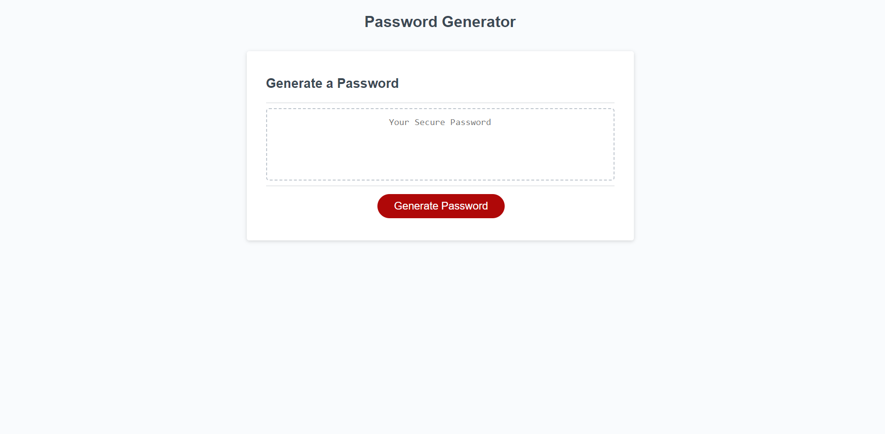

# password-generator-id

## Description

I build this password generator to help people create unique passwords so they can keep their accounts secure. You can select all or one of the character types to complete your password, you are also allowed to pick from 8-128 characters in the process. I learned many new features about JS and the different ways you can experiment with it.

## Installation

This webpage can be ran on any browser or device.

## Usage

## Credits

Tutor Jacob Carver

Professor Joe Han

TA Paul Cwik

W3 Schools

## License 

Linked in repository 